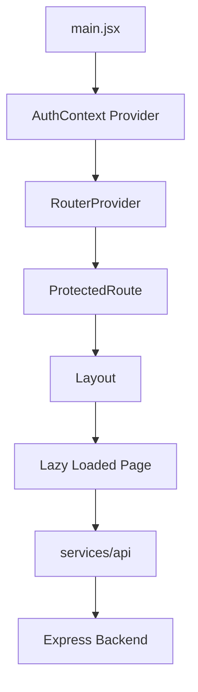

# OptiFlow Frontend Architecture

This developer guide is for the 5-member frontend team. It explains the structure, conventions, and routing of the React application. 

## 1. Overview
- **What it is:** The OptiFlow frontend, a modular Single Page Application (SPA).
- **Tech Stack:** Vite, React, React Router DOM (`createBrowserRouter`).
- **Backend:** Express API running at `back-end-new`.
- **Environment:** Reads the backend base URL from `VITE_API_URL` (configured via `.env`, copy from `.env.example`).
- **How to run:**
  1. `npm install`
  2. `cp .env.example .env`
  3. `npm run dev`
  4. Ensure the backend is running. CORS must allow the Vite origin (usually `http://localhost:5173`).

## 2. Folder Tree
```text
src/
├── app/         # Core routing, paths, and route protection logic
├── assets/      # Static assets (images, SVGs)
├── config/      # Global configuration (env) and navigation structures
├── context/     # Global React context providers (Auth)
├── features/    # Isolated feature modules grouped by actor
├── layouts/     # High-level page wrappers (Sidebar + Topbar)
├── services/    # API interaction layer
└── shared/      # Reusable UI components, hooks, and utilities
```

## 3. Folder-by-Folder Guide

### `src/app/`
- **Purpose:** Centralizes routing, URL constants, and access control.
- **What goes here:** `router/index.jsx`, `paths/index.js`, `guards/index.jsx`, and `routes/<actor>.jsx`.
- **What must NOT go here:** UI components, page layouts, or data fetching logic.
- **Who may edit it:** M3 owner (via PR) for router/paths/guards. Feature owners can edit their specific `routes/<actor>.jsx` file.

**Key Files:**
- `paths/index.js`: Exports all URL strings as a constant object `PATHS`.
  ```javascript
  export const PATHS = {
    PUBLIC: { LOGIN: '/login' },
    PM: { DASHBOARD: '/pm/dashboard' }
  };
  ```
- `router/index.jsx`: Uses `createBrowserRouter` to merge route arrays and apply layouts.
  ```javascript
  export const router = createBrowserRouter([
    {
      element: <ProtectedRoute allowedRoles={['company_owner', ...]} />,
      children: [ { element: <DashboardLayout />, children: [ ...wrapSuspense(pmRoutes) ] } ]
    }
  ]);
  ```
- `guards/index.jsx`: `ProtectedRoute` checks the `AuthContext` user and redirects if unauthenticated or unauthorized. `RoleRedirect` sends users to their specific dashboards after login.

### `src/config/`
- **Purpose:** Configuration logic outside of React's lifecycle.
- **What goes here:** `env.js` (environment variable parser), `nav/` (sidebar configurations).
- **What must NOT go here:** React components or API calls.
- **Who may edit it:** M3 owner.

**Key Files:**
- `env.js`: Maps `import.meta.env` to a centralized `env` object.

### `src/context/`
- **Purpose:** App-wide state management.
- **What goes here:** `AuthContext.jsx`.
- **What must NOT go here:** Feature-specific state.
- **Who may edit it:** M3 owner.

**Key Files:**
- `AuthContext.jsx`: Manages the JWT token and user identity. Exposes `login()`, `platformLogin()`, `logout()`, and the `user` object.

### `src/services/api/`
- **Purpose:** Encapsulates all backend HTTP calls.
- **What goes here:** `client.js` (fetch wrapper) and resource files (`users.js`, `projects.js`, etc.).
- **What must NOT go here:** React state hooks or UI logic.
- **Who may edit it:** M3 owner for `client.js`. Feature owners can edit/add endpoints to their resource files.

**Key Files:**
- `client.js`: Attaches the `Bearer` token from `sessionStorage`, parses JSON, handles `401` redirects, and throws readable errors.
  ```javascript
  if (response.status === 401) {
    sessionStorage.removeItem('authToken');
    window.location.href = '/login';
  }
  ```

### `src/layouts/`
- **Purpose:** High-level UI wrappers that persist across pages.
- **What goes here:** `DashboardLayout.jsx` and `PlatformLayout.jsx`.
- **What must NOT go here:** Individual page content.
- **Who may edit it:** M3 owner.

**Key Files:**
- `DashboardLayout.jsx`: Provides the tenant application shell, including the topbar, sidebar, and `<Outlet />`.

### `src/shared/`
- **Purpose:** Reusable atomic UI components and utilities.
- **What goes here:** `components/` (Button, Table, Modal), `hooks/`, `utils/`.
- **What must NOT go here:** Domain-specific business logic.
- **Who may edit it:** M3 owner (via PR).

### `src/features/<actor>/`
- **Purpose:** Domain-driven feature slices for specific tenant roles (e.g., `executive`, `hr`, `platform`).
- **What goes here:** `pages/` (route components) and `components/` (local UI elements).
- **What must NOT go here:** Global layouts or API client config.
- **Who may edit it:** The respective Feature Owner (M1-M5).

### `src/features/work/`
- **Purpose:** Groups related project/task execution features for PMs, Team Leads, and Members.
- **What goes here:** Sub-actors `pm/`, `team-lead/`, `member/` (each with `pages/` and `components/`), and `shared/components/` for work-specific UI.
- **What must NOT go here:** System-wide generic shared components.
- **Who may edit it:** M4 owner.

### `src/features/common/`
- **Purpose:** Groups public or shared pages applicable to multiple actors.
- **What goes here:** `pages/` for Login, Register, Profile, Notifications, 404, Unauthorized.
- **What must NOT go here:** Specific dashboard views.
- **Who may edit it:** M3 owner.

## 4. How Everything is Connected



1. **App startup:** `main.jsx` wraps the app in the `AuthContext` provider, which wraps the `router` from `app/router/index.jsx`.
2. **Login:** A user submits the form on the login page -> calls `AuthContext.login` -> calls `services/api` -> sends `POST /auth/login` -> the backend returns `{ token, user }`. The token is stored in `sessionStorage` under `authToken`. The router hits `<RoleRedirect />`, which routes the user to their specific dashboard based on their role slug.
3. **Navigating to a protected page:** The route array maps the URL to a page component. The `router` wraps this in a `<ProtectedRoute allowedRoles={[...]}>`. If the user's role matches, it renders the `<DashboardLayout>`, which finally renders the page via `<Outlet />`.
4. **A page loading data:** The page component mounts -> calls a function in `services/api/projects.js` -> which calls `client.js`. The client injects `Authorization: Bearer <token>`, fetches data from the backend, unwraps the response, handles potential `401` errors, and returns the data back to the page state.
5. **Platform admin flow:** Platform administrators manage multiple tenants. They use a separate authentication route (`POST /platform/auth/login`), get a separate identity shape (`req.platformAdmin` vs `req.user`), and require a separate layout (`PlatformLayout`) to prevent accidental leakage into tenant contexts. This is enforced by `isPlatform={true}` on the protected route.
6. **Sidebar Construction:** The layouts wrap the `<Outlet />` with a top bar and a sidebar constructed from the navigation configurations in `config/nav/<actor>.nav.js` mapping to `paths.js`.

## 5. Roles and Routing Table

| Actor | Role Slug (Backend) | Base URL | Route File | Nav File (Intended) | Features Folder | Owner |
|---|---|---|---|---|---|---|
| Executive / CEO | `company_owner` | `/executive` | `executive.jsx` | `executive.nav.js` | `features/executive` | M1 |
| Compliance Officer | `compliance_officer` | `/compliance` | `compliance.jsx` | `compliance.nav.js` | `features/compliance` | M1 |
| HR / Access Gov. | `hr_manager` | `/hr` | `hr.jsx` | `hr.nav.js` | `features/hr` | M2 |
| Process Admin | `process_admin` | `/process-admin` | `process-admin.jsx` | `process-admin.nav.js` | `features/process-admin` | M3 |
| Project Manager | `project_manager` | `/pm` | `pm.jsx` | `pm.nav.js` | `features/work/pm` | M4 |
| Team Leader | `team_leader` | `/team-lead` | `team-lead.jsx` | `team-lead.nav.js` | `features/work/team-lead` | M4 |
| Team Member | `team_member` | `/member` | `member.jsx` | `member.nav.js` | `features/work/member` | M4 |
| Platform Admin | `system_admin` | `/platform` | `platform.jsx` | `platform.nav.js` | `features/platform` | M5 |

## 6. Step-by-Step Recipes

**Add a new page to your actor:**
1. Create `MyNewPage.jsx` inside `src/features/<actor>/pages/`.
2. Add the URL constant to `src/app/paths/index.js` (e.g. `NEW_PAGE: '/hr/new-page'`).
3. Add the route object to your actor's route file (e.g. `src/app/routes/hr.jsx`).
4. Add the navigation link to the sidebar config (`src/config/nav/<actor>.nav.js`).

**Call a backend endpoint:**
1. Ensure the endpoint exists in the corresponding `src/services/api/<resource>.js` file.
2. In your page, use standard React state (`data`, `loading`, `error`).
3. Use a `useEffect` to call the API function, catch errors, and set the state.
4. Render using the shared `<Loader />` and `<ErrorBoundary />` components.

**Add a shared component:**
- If the component is highly specific to your feature (e.g. `TaskReviewCard`), put it in `src/features/<actor>/components/`.
- If it is generic and needed by others (e.g. a specialized Dropdown), put it in `src/shared/components/` and submit a PR to the M3 owner.

**Add a new protected route for a different role:**
- Open `src/app/router/index.jsx`.
- If the role doesn't exist yet, create a new `<ProtectedRoute>` block, configure `allowedRoles`, assign a Layout, and inject the lazy-loaded routes array.

**Show a form that POSTs and refreshes the list:**
1. Render a form using `<FormField>` components.
2. On submit, call `api.create(formData)`.
3. Await the response, then trigger a re-fetch of your list state (or optimistic UI update).

## 7. Conventions
- **Naming:** Components are `PascalCase.jsx`. Functions/hooks are `camelCase.js`.
- **One Component Per File:** Do not declare multiple functional components in one file.
- **No Hardcoded URLs:** Always import and use `PATHS` from `src/app/paths/index.js`.
- **API Fetching:** No raw `fetch` calls in pages. Always go through `src/services/api/`.
- **Token Storage:** Do not use `localStorage`. Tokens must be stored in `sessionStorage` under the key `authToken`.
- **State Handling:** Use the shared `<Loader />`, `<EmptyState />`, and `<ErrorBoundary />` components for consistent UX.
- **API Envelope:** The API wrapper automatically strips the `{ success: true, data: ... }` envelope, returning just the payload.

## 8. Team Workflow

| Area | Owner | May Edit | Notes |
|---|---|---|---|
| `features/compliance`, `executive` | M1 | M1 | Edit directly. |
| `features/hr` | M2 | M2 | Edit directly. |
| `features/process-admin`, `common` | M3 | M3 | Foundation lead. |
| `features/work` (PM, TL, Member) | M4 | M4 | Edit directly. |
| `features/platform` | M5 | M5 | Edit directly. |
| `shared/`, `layouts/`, `services/api/client.js`, `app/router`, `paths.js` | M3 | M3 | **Requires PR to M3.** |

- **Branch Naming:** Format branches as `feature/<actor>/feature-name` (e.g., `feature/hr/user-table`).
- **Small PRs:** Keep pull requests focused on a single feature or bug fix.
- **Merge Conflicts:** By keeping feature development isolated to specific `features/<actor>` directories and isolated `app/routes/<actor>.jsx` files, cross-team merge conflicts on `router.jsx` are completely avoided.

## 9. Backend Contract Cheat Sheet
- **Public:** `GET /auth/public-plans`, `POST /auth/login`, `POST /auth/register-company`
- **Tenant Context:** Requires `Authorization: Bearer <tenant-token>`. The backend **strictly ignores** `x-company-id` and `x-user-role` headers to prevent spoofing. It extracts the tenant context entirely from the JWT signature.
- **Platform Context:** Requires `Authorization: Bearer <platform-token>`. 
- **Key Endpoints:** `/projects`, `/tasks`, `/users`, `/roles`, `/compliance-rules`, `/process-templates`. 

## 10. Troubleshooting
- **CORS Error:** Ensure the backend `cors` configuration in `back-end-new` allows `http://localhost:5173`.
- **401 Loop:** If the page refreshes endlessly on load, the JWT is expired or malformed. `client.js` clears it, but ensure your `AuthContext` isn't re-hydrating bad state.
- **Blank Page After Login:** Check the browser console. Usually means `RoleRedirect` received a role slug that isn't mapped in `guards/index.jsx`.
- **"Role Not Allowed" / Unauthorized Redirect:** Ensure the role slug inside `req.user.role` from the backend exactly matches the array in `app/router/index.jsx`.
- **Route Not Found:** Ensure your path is defined in `paths.js` and properly mapped to a lazy component in your `app/routes/<actor>.jsx` file.
- **Env Var Not Loading:** Ensure the variable in `.env` is prefixed with `VITE_` (e.g., `VITE_API_URL`). Restart the Vite dev server after changing `.env`.

## 11. Known Gaps
- **Navigation Config Missing:** The `src/config/nav/` directory is currently empty. There are no `<actor>.nav.js` files defining sidebar links yet. The layouts (`DashboardLayout.jsx`, `PlatformLayout.jsx`) are currently using hardcoded "Sidebar" string placeholders.
- **Mocked AuthContext:** `AuthContext.jsx` currently hardcodes the user identity on mount (`{ fullName: 'Test User', role: 'team_member' }`) instead of making a real request to `GET /auth/me` or `GET /platform/auth/me`.
- **Stub Components:** The components inside `src/shared/components/` (like `Button`, `Table`, `Modal`) are currently empty `div` placeholders and need real implementations.
- **Page Stubs:** The UI for all routes in `src/features/` currently render plain HTML stubs displaying the endpoints they are meant to consume.

## SECTION A: Work Distribution

### 1. Ownership Table

| Member | Actor(s) | Backend Areas Used | Pages & Routes | Folders They May Edit | Estimated Load |
|---|---|---|---|---|---|
| **M1** | Compliance Officer + CEO (Company Owner) | `compliance-rules`, `compliance-categories`, `compliance-bindings`, `compliance-violations`, `evidence`, `audit-logs`, `executive/metrics`, `executive/branches` | **CEO:** Dashboard (`/executive/dashboard`), Projects (`/executive/projects`), Audit Logs (`/executive/audit-logs`) <br><br> **Compliance:** Dashboard (`/compliance/dashboard`), Rules (`/compliance/rules`), Categories (`/compliance/categories`), Bindings (`/compliance/bindings`), Violations (`/compliance/violations`), Evidence (`/compliance/evidence`), Audit Logs (`/compliance/audit-logs`) | `features/executive/`, `features/compliance/`, `app/routes/executive.jsx`, `app/routes/compliance.jsx` | High (Data heavy) |
| **M2** | HR / Access Governance | `users`, `roles`, `role-assignments`, `branches`, `teams` | **HR:** Dashboard (`/hr/dashboard`), Users (`/hr/users`), User Detail (`/hr/users/:id`), Roles (`/hr/roles`), Role Assignments (`/hr/role-assignments`), Branches (`/hr/branches`), Teams (`/hr/teams`) | `features/hr/`, `app/routes/hr.jsx` | Medium |
| **M3** | Process Admin + Shared Foundation | `process-templates`, `process-instances`, `process-instance-steps`, `auth`, `notifications` | **Process Admin:** Dashboard (`/process-admin/dashboard`), Templates (`/process-admin/templates`), Template Detail (`/process-admin/templates/:id`), Instances (`/process-admin/instances`), Instance Detail (`/process-admin/instances/:id`) <br><br> **Shared:** Login (`/login`), Register (`/register`), Notifications (`/notifications`), Profile (`/profile`), Platform Login (`/platform/login`), 404/Unauthorized | `features/process-admin/`, `features/common/`, `app/routes/process-admin.jsx`, `app/routes/common.jsx`, `shared/`, `layouts/`, `services/api/client.js`, `app/paths/`, `app/router/`, `context/` | High (Core framework + Feature) |
| **M4** | Project Manager + Team Leader + Team Member | `projects`, `tasks`, `subtasks`, `escalations`, `evidence` | **PM:** Dashboard (`/pm/dashboard`), Projects (`/pm/projects`), Project Detail (`/pm/projects/:id`), Tasks (`/pm/tasks`), Task Detail (`/pm/tasks/:id`), Escalations (`/pm/escalations`) <br><br> **TL:** Dashboard (`/team-lead/dashboard`), Tasks (`/team-lead/tasks`), Task Detail (`/team-lead/tasks/:id`), Reviews (`/team-lead/reviews`), Escalations (`/team-lead/escalations`) <br><br> **Member:** Dashboard (`/member/dashboard`), Tasks (`/member/tasks`), Task Detail (`/member/tasks/:id`), Evidence (`/member/evidence`), Escalations (`/member/escalations`) | `features/work/pm/`, `features/work/team-lead/`, `features/work/member/`, `features/work/shared/`, `app/routes/pm.jsx`, `app/routes/team-lead.jsx`, `app/routes/member.jsx` | Heaviest (Three roles) |
| **M5** | Platform Admin | `platform/auth`, `platform/metrics`, `companies`, `plans`, `subscriptions`, `platform-admin-users`, `platform/support-access` | **Platform:** Dashboard (`/platform/dashboard`), Companies (`/platform/companies`), Plans (`/platform/plans`), Subscriptions (`/platform/subscriptions`), Admin Users (`/platform/admin-users`), Support Access (`/platform/support-access`) | `features/platform/`, `app/routes/platform.jsx` | Medium |

### 2. Shared vs. Owned Rules
- **Owned:** Feature folders (e.g., `features/work/pm`), individual route arrays (e.g., `app/routes/pm.jsx`), and dedicated API wrappers (e.g., `services/api/projects.js`). The designated member edits these directly without requiring a cross-team PR.
- **Shared:** Core infrastructure files (`shared/components/*`, `layouts/`, `services/api/client.js`, `app/paths/index.js`, `app/router/index.jsx`, `context/AuthContext.jsx`). **Any modification to these files must be submitted via PR and reviewed/approved by M3.**

### 3. Cross-Member Dependencies
- **M4 and M1 API Overlap:** Both M4 (Team Member uploading evidence) and M1 (Compliance approving evidence) hit the `/evidence` backend. To prevent duplication, they must agree on a single `services/api/evidence.js` file (owned by M1, utilized by both).
- **UI Components:** Everyone depends on M3's shared foundation (`Table`, `Modal`, `FormField`, `AuthContext`). M3 must prioritize building these generic atomic components early so M1, M2, M4, and M5 can consume them instead of building redundant local UI.

### 4. Phased Execution Plan

- **Phase 0: Foundation Scaffold** 
  - *Exit Criteria:* React structure is pushed to main, `paths.js` and routing arrays exist, empty stubs load correctly, `client.js` is merged by M3.
- **Phase 1: Read-Only Dashboards & Lists**
  - *Exit Criteria:* Each member builds their list pages (e.g. `/hr/users`) fetching real API data and rendering it in basic tables.
- **Phase 2: Mutations (Create/Edit/Delete)**
  - *Exit Criteria:* Forms are wired up to POST/PATCH endpoints. Users can be created, tasks assigned, evidence uploaded, and state correctly reloads.
- **Phase 3: Cross-Role Integration Testing**
  - *Exit Criteria:* End-to-end flows (e.g. PM creates task -> Member completes -> Compliance approves) are tested manually across roles in sequence.
- **Phase 4: Polish and Demo**
  - *Exit Criteria:* Loading spinners, empty states, error boundaries, styling cleanup, and recording of the final demo video.

### 5. Git Workflow
- **Branch Naming:** Create a branch per member or feature using the format `feature/<actor>/description` (e.g., `feature/pm/create-task-form`).
- **PR Size:** Keep PRs small and targeted. Do not batch 10 pages into one PR.
- **Reviewers:** Peer-review within the team. Shared structural changes MUST be reviewed by M3.
- **Environment:** **Never commit the `.env` file.** Keep `.env.example` updated if new vars are needed.

## SECTION B: Definition of Done: What Is Needed At The End

### 1. Per-Actor Implementation Checklist
- [ ] Every page mapped in the route file is fully implemented (no stubs).
- [ ] Every API call utilizes `services/api` wrapper functions (no raw `fetch` calls inside components).
- [ ] Loading spinners (`<Loader />`), error boundaries, and empty states (`<EmptyState />`) are appropriately handled using shared components.
- [ ] Create, Edit, and Delete forms work strictly in alignment with backend capabilities.
- [ ] The `ProtectedRoute` role guard actively blocks unauthorized actor access.
- [ ] Sidebar navigation links match the actual routes defined in `paths.js`.

### 2. Whole-App System Checklist
- [ ] Login redirects each distinct role strictly to their designated dashboard.
- [ ] Logout fully clears `sessionStorage` and forces navigation back to `/login`.
- [ ] Encountering a `401 Unauthorized` API response gracefully redirects to `/login`.
- [ ] Platform Admin uses the separate login portal and maintains isolated layout wrappers.
- [ ] Running `npm run build` passes with exactly zero errors or warnings.
- [ ] No red console errors fire during standard E2E flows.
- [ ] No hardcoded string URLs exist (all routes imported from `PATHS`).
- [ ] `.env.example` remains up to date.

### 3. Cross-Role E2E Scenarios (Seeded Data)
*Use the seeded test accounts. All passwords are `password123`.*
- [ ] **Scenario A (Task -> Evidence Workflow):** 
  - PM (`pm@acme.com`) creates a task and assigns it to Team Leader (`tl@acme.com`). 
  - TL splits it into subtasks for Team Member (`employee@acme.com`). 
  - Member completes the task and uploads evidence. 
  - Compliance Officer (`compliance@acme.com`) reviews and approves the evidence.
- [ ] **Scenario B (HR Governance):** 
  - HR Manager (`hr@acme.com`) creates a new user and grants them a specific role assignment.
- [ ] **Scenario C (Process Pipeline):** 
  - Process Admin (`admin@acme.com`) builds a new template with 3 distinct steps. 
  - An instance is initiated, step 1 is approved, and step 2 is rejected (verifying the loopback mechanism to step 1).
- [ ] **Scenario D (Executive Oversight):** 
  - CEO (`ceo@acme.com`) views the executive dashboard metrics.
  - Verifies the audit log successfully tracked the actions performed in Scenarios A, B, and C.
- [ ] **Scenario E (Platform Governance):** 
  - Platform Admin (`admin@platform.com`) logs into the isolated `/platform/login` portal.
  - Views the active SaaS companies, available pricing plans, and high-level platform metrics.

### 4. Backend Readiness Checklist
- [ ] Express backend (`back-end-new`) is running cleanly on port 5500.
- [ ] PostgreSQL database is fully populated via `npm run seed`.
- [ ] Backend CORS configuration explicitly permits requests from `http://localhost:5173`.

### 5. Submission Checklist
- [ ] Root `README.md` is updated describing the full scope.
- [ ] `ARCHITECTURE.md` is present and accurate.
- [ ] Final demo video recorded showcasing all E2E scenarios.
- [ ] Relevant screenshots taken.
- [ ] All other deliverables explicitly requested by the repository's root instructions are fulfilled.

### 6. Sign-Off Matrix

| Checklist Group | Responsible Member | Final Reviewer |
|---|---|---|
| Executive & Compliance (M1) Pages | M1 | M2 |
| HR (M2) Pages | M2 | M4 |
| Process Admin & Shared UI (M3) | M3 | M1 |
| PM, TL, Member (M4) Pages | M4 | M5 |
| Platform Admin (M5) Pages | M5 | M3 |
| E2E Testing Scenarios | Team | Team |
| Final Build & Submission | M3 | M1 |

### Known Gaps
- The `src/config/nav/` directory remains unpopulated (`executive.nav.js`, `pm.nav.js`, etc., do not exist yet). Sidebars currently rely on hardcoded mock strings in Layout components.
- The `AuthContext.jsx` currently mocks user login on initialization instead of pinging `GET /auth/me` to hydrate state properly.
